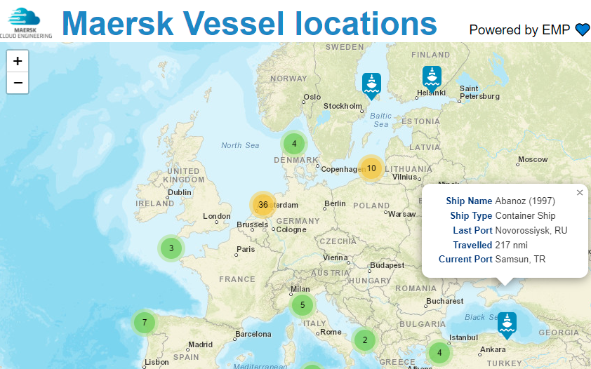

# EMP-Kafka-demo

This demo maps real-time location information of all Maersk container vessles using a production topic in EMP (Event Management Platform). The application constantly consumes the topic to first populate, and then continually update ship positions.



The backend is written in **Python** using the [flask] module to host a single page webapp and [confluent-kafka-python] module to handle consuming events from Kafka. 

The frontend is implemented in **Javascript** using [Leaflet.js] for interactive mapping and [Leaflet.markercluster] to cluster markers in close proximity into a single marker to ensure the page remains performant when more than 1000 markers are placed on the map.

# Implementation details

## Serving the webapp

We create a very Python simple webapp (`app.py`) using the [Flask] module which we can access on http://127.0.0.1:5001/. The code for this looks like this:

```python
from flask import Flask, Response, render_template

app = Flask(__name__)

@app.route("/")
def index():
    return render_template("index.html")
```

This serves the contents of the `templates/index.html` file, whch is a basic page.

## Creating our main page which will contain the map

In the `head` section of our `templates/index.html` file we include the  resources for [Leaflet.js] and  [Leaflet.markercluster] which will be used to display an interactive map:

```html
  <link rel="stylesheet" href="https://unpkg.com/leaflet@1.8.0/dist/leaflet.css"
    integrity="sha512-hoalWLoI8r4UszCkZ5kL8vayOGVae1oxXe/2A4AO6J9+580uKHDO3JdHb7NzwwzK5xr/Fs0W40kiNHxM9vyTtQ=="
    crossorigin="" />
  <script src="https://unpkg.com/leaflet@1.8.0/dist/leaflet.js"
    integrity="sha512-BB3hKbKWOc9Ez/TAwyWxNXeoV9c1v6FIeYiBieIWkpLjauysF18NzgR1MBNBXf8/KABdlkX68nAhlwcDFLGPCQ=="
    crossorigin=""></script>

  <link rel="stylesheet" href="https://unpkg.com/leaflet.markercluster@1.4.1/dist/MarkerCluster.css" />
  <link rel="stylesheet" href="https://unpkg.com/leaflet.markercluster@1.4.1/dist/MarkerCluster.Default.css" />
  <script src="https://unpkg.com/leaflet.markercluster@1.4.1/dist/leaflet.markercluster-src.js"></script>
```

Next, in our `body` we create a `div` element to hold the interactive map, and includes our Javascript code (from `static/leaf.js`) which will listen for updates from the backend webapp and update the map accordingly.

```html
  <div id="map" style="width:100%; height:1000px;"></div>
  <script src="../static/leaf.js"></script>
```

⭐ To see the HTML template in it's entirety, see [index.html](templates/index.html)

## Displaying the map.

Our first piece of Javascript being added in the `static/leaf.js` file is to initialise the map. This will be an empty map, but the interactive features for zooming and panning will be active.

```js
var map = L.map('map').setView([52, 2], 3);

L.tileLayer('https://server.arcgisonline.com/ArcGIS/rest/services/World_Street_Map/MapServer/tile/{z}/{y}/{x}', {
  attribution: 'Tiles &copy; Esri &mdash; Source: Esri, DeLorme, NAVTEQ, USGS, Intermap, iPC, NRCAN, Esri Japan, METI, Esri China (Hong Kong), Esri (Thailand), TomTom, 2012'
}).addTo(map);

```

## Fetching information from Kafka

Now we need to go back to the backed code to fetch the data make it available to our page using [Server-Sent Events] (SSEs). 

As this is backend, the code will be located in `app.py`.

We start by creating a route (`/map/live`) which will retrieve the data from Kafka. In the function attached to the route we supply the details to connect to our Kafka cluster, subscribe to our topic and then call the `event())` function to poll Kafka and send the data to the webpage. This is all made quite simple by the [confluent-kafka-python] module which provides us with a consumer class.

**NOTE:** Some configuration data is read from environmental variables to prevent secrets from being added to GitHub. You must ensure you have these variables set appropriately in your environment.

```python
import json, os, time # Import some standard lbraries we need later
from confluent_kafka import Consumer # Import the confluent kafka consumer.

@app.route("/map/live")
def get_messages():
    ``` Function to fetch ship information from kafka and then send the data to out page ```

    c = Consumer(
        {
            "bootstrap.servers": "pkc-lq8gm.westeurope.azure.confluent.cloud:9092",
            "security.protocol": "SASL_SSL",
            "sasl.mechanisms": "PLAIN",
            "sasl.username": "{}".format(os.environ.get("PROD_CCLOUD_KEY")),
            "sasl.password": "{}".format(os.environ.get("PROD_CCLOUD_SECRET")),
            "session.timeout.ms": 45000,
            "group.id": "EMP-Kafka-map-demo",
            "auto.offset.reset": "latest",
        }
    )

    c.subscribe(["MSK.arrivalIntelligence.marineTrafficAisReading.topic.internal.any.v1"])
    return Response(events(c), mimetype="text/event-stream")

# Run the webapp
if __name__ == "__main__":
    app.run(debug=False, port=5001)
```

Now we define the `events()` function which uses the supplied consumer client to poll Kafka. In the event that no message is returned, or we get an occasional error we just continue looping until there is information available.

This particular topic receives around 3 million updates per day (or 34 events per second) so we will always have some data to demo!

```python
    # 2. Poll kafka for data and Send it to the webpage.
    def events(c):
        while True:
            msg = c.poll(5.0)
            if msg is None:
                continue
            if msg.error():
                continue

            data = json.loads(msg.value().decode("utf-8"))
            if data.get("TYPE_NAME") == "Container Ship":
                time.sleep(0.1)
                yield "data: {}\n\n".format(msg.value().decode("utf-8"))

```

**NOTE** - The [Leaflet.js] library performs badly after around 10k markers are added to the map. There are various workarounds to avoide this but for our simple demo we just limit it to displaying "Containuer Ship". This provides us with a maximum of ~5k ships to display markers for.

⭐ To see the final backend app code in it's entirety, see [app.py](app.py)

## Updating the map with the ship data

Now that we have data that can be utilized by the frontend it is time to add some more Javascript to the `statis/leaf.js` file.

We will be using [Leaflet.js] **markers** to mark the position of a ship on the map and adding a popup to display information about a ship if the user clicks on the marker. In addition, we may receive updated information about a ship's location and therefore we need to track which ships have already been added to the map.

We need:

 * a custom ship marker to replace the standard "pin" icon on the map:
 * a `mapMarkers` object to associate each marker with the ship's name so that we can test if the ship has already been seen and act accordingly.
 * a **clustergroup** which is a feature of the [Leaflet.markercluster] library to reduce the number of map markers shown when zoomed out of the map. Markers are added or removed from a Layer within the cluster group (as we will show shortly)

```js
var ShipIcon = L.icon({ iconUrl: '/static/ship.png'
                      , iconSize: [27, 40]
                      , iconAnchor: [14, 40]
                      , popupAnchor: [-3, -76] 
                      });
var mapMarkers = {};
var clusterGroup = L.markerClusterGroup();
```

Now we will create an EventSource to listen for data from the backend (using the route `/map/live`) and call `process_event()`.

```js
var source = new EventSource('/map/live');
source.addEventListener('message', function (e) {

  eventData = JSON.parse(e.data);
  process_event(eventData)

}, false);

```

The function `process_event()` will update the map and log details to the console so that we can see the liev event stream in real-time. 

```js
// Update the map by adding/removing markers with popups
function process_event(d) {
  log_data_to_console(d)
  remove_marker_if_exists(d)
  add_marker(d)
  refresh_map(d)
}
```

For each event received, we process the data (which has been JSON decoded into `eventData`) and check to see if a marker already exists for the ship in `mapMarkers`. If it does, we remove the marker from the `clusterGroup`.  

```js
// Delete any existing marker for this ship.
function remove_marker_if_exists(data) {
  if (data.SHIPNAME in mapMarkers) {
    clusterGroup.removeLayer(mapMarkers[data.SHIPNAME]);
  }
}
```

Then we create a marker for the ship (complete with popup) and store it in `mapMarkers`. If the marker was removed in the last step then it will appear to the user that it "moved" to the new location.  

Only the ship's name is added to the popup here , but any information received from the backend could be displayed here (in the actual code we have the function `getShipInformation()` which returns an HTML table with more information).

```js
// Create a ship marker
function add_marker(data) {
  mapMarkers[data.SHIPNAME] = L.marker([Number(data.LAT), Number(data.LON)], { icon: ShipIcon });
  mapMarkers[data.SHIPNAME].bindPopup(data.SHIPNAME);
}
```

Finally we refresh the map by adding the marker to the cluster group, the cluster group to the map and then we refresh the cluster groups so that the new marker is merged with other markers if needed.

```js
// Add the marker to the clsutergroup, refresh it and then add it to the map
function refresh_map(data) {
  clusterGroup.addLayer(mapMarkers[data.SHIPNAME]);
  map.addLayer(clusterGroup);
  clusterGroup.refreshClusters();
}
```

⭐ To see the final javascript code in it's entirety, see [leaf.js](static/leaf.js)

[confluent-kafka-python]: https://github.com/confluentinc/confluent-kafka-python
[flask]: https://flask.palletsprojects.com/en/2.1.x/
[leaflet.js]: https://github.com/Leaflet/Leaflet.markercluster
[Leaflet.markercluster]: https://github.com/Leaflet/Leaflet.markercluster
[Server-Sent Events]: https://www.html5rocks.com/en/tutorials/eventsource/basics/
